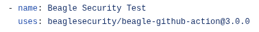
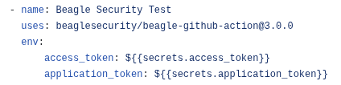

# Beagle-Github-Action
To trigger Beagle penetration testing via Github Action

## Prerequisites

* Obtain Application Token and Access Token from Beagle Dashboard

### What is Beagle?

Beagle is an intelligent and holistic platform to make your applications hack-proof. The platform provides continuous and automated Penetration Testing (under human supervision) for organizations, so that they can always stay on top of the cyber threats.

In short, Beagle finds out how deep your system can be penetrated. Know it before the hackers do! 

* [Beagle Security](https://beaglesecurity.com/) - Visit for more Details!

### Generate your Access Token From Beagle User Settings:
  Settings -> Access token -> Generate your new personal access token


### Generate your Application Token From Beagle
  Home -> Applications -> Select your application -> Settings -> Application token


## Adding Beagle-Github-Action to your Project

1. Add the Application Key and Access Key as secrets in your repo.
    * Navigate to Secrets in repo settings.
    * Add beagle access_token and application_token as secrets.
2. Browse Marketplace and search for `Beagle Security Test`. 
3. Copy the code snippet to your ```main.yml```.
     * 
4. Provide environment variables to the action following the code snippet: 
     * 
# Authors

* **Beagle Security**

## License

This project is licensed under the MIT License - see the [LICENSE.md](LICENSE.md) file for details.
